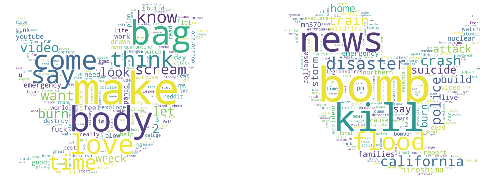

# Twitter Disaster Classification Using LSTM, Attention and Transformers

Author: TeYang, Lau  
Last Updated: 22 December 2020

  

### **Please refer to this [notebook](https://www.kaggle.com/teyang/melanoma-detection-using-effnet-and-meta-data) on Kaggle for a more detailed description, analysis and insights of the project.** 

## **Project Motivation** 

For this project, I applied **sequence models** to sequential data in a NLP problem of classifying twitter data into whether they are about disaster events or not. This is easy for a human, but a computer will find it difficult as languages contain multiple complexities. A model will thus will have to take into account the sequential nature of the tweet, the meaning and representation of each word in numbers, as well as the importance and contribution of other words in the same sequence, since two words can have completely different meanings in two different contexts. Here, I will be using **Long-Short Term Memory (LSTM)**, **Attention** and **Transformers **models, which have provided state-of-the-art results for many NLP tasks.

This project also used to be a competition on **Kaggle**, but I didn't have the time nor the knowledge to complete the challenge the first time I joined. After finishing a deep learning specialization course and doing more readings on sequential models, I am back to tackle this problem again!

## **Project Goals** 

1. *Explore* using different sequence models **(LSTM, Attention, Transformers)** for NLP sentence classification problem
2. *Preprocess/Clean* tweets data into appropriate format for inputting into neural network models 
3. *Understand* **word embeddings** and how they are used to represent words as inputs into NLP models
4. *Engineer* new features from tweets data that can help to improve model classification

## **Project Overview** 

* Preprocess and clean tweets data
* Exploratory data analysis of the texts to understand the text structure
* **Engineer meta-features** from the text for training additional model for **ensemble**
* Wrangling text into appropriate format as inputs into models (**tokenization**, **padding**)
* Using **GloVe embeddings** for **word representation**
* Training **LSTM**, **Bidirectional LSTM with Attention**, and **BERT** models
* **Error Analysis** to look at mistakes made by models

## **About this Dataset** 

The dataset contains 10,000 tweets that were classified as disaster or non-disaster. It was created by the company figure-eight and originally shared on their [‘Data For Everyone’ website](https://www.figure-eight.com/data-for-everyone/).

## Exploratory Data Analysis

#### Most Common Bigrams

#### Most Common Trigrams

  

## Text Preprocessing/Cleaning

- Expand Contractions

- Remove Emojis

- Remove URLs

- Remove Punctuations except '!?' as they convey intensity and tonality of tweet

- Replace 'amp' with 'and'

- Word Segmentaion - segment words such as 'iwould' into 'i' and 'would'

- Lemmatization - reduces inflected words into their root form; verb part-of-speech tag is used here)

  

#### Most Common Words After Cleaning

  

## LSTM

## Bidirectional LSTM with Attention

## BERT

## Error Analysis

## Conclusion